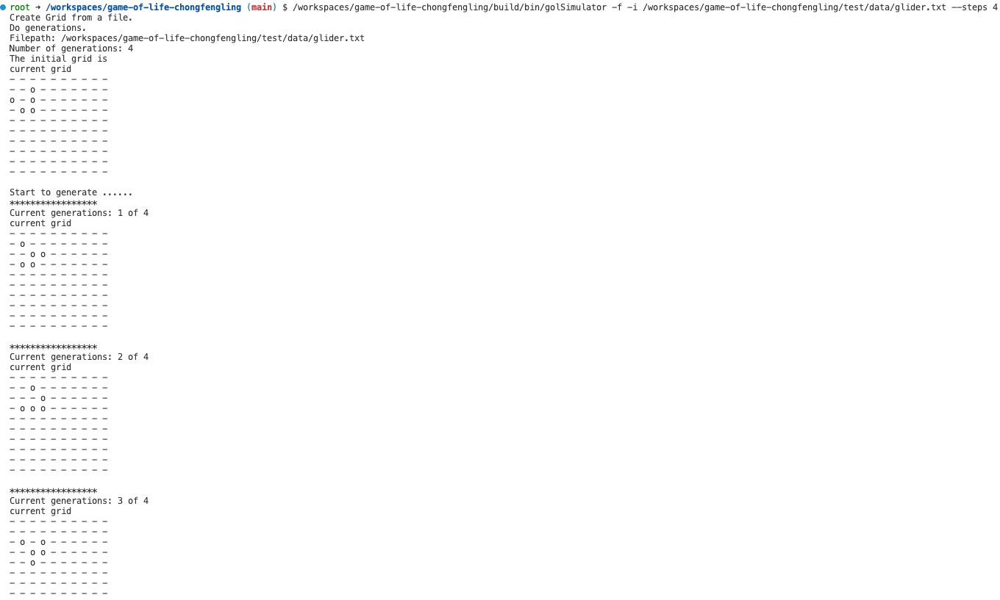
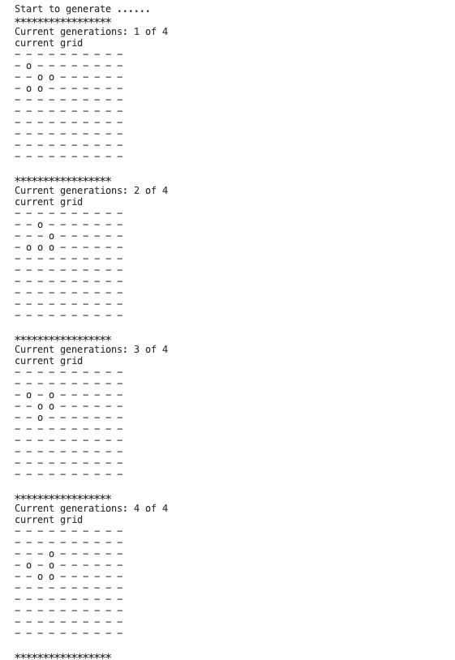

[](https://classroom.github.com/open-in-codespaces?assignment_repo_id=9991342)
PHAS0100ASSIGNMENT1
------------------

# Purpose

This project serves as a starting point for the PHAS0100 2022/23 Assignment 1 Game of Life Simulation coursework. It has a reasonable folder structure for [CMake](https://cmake.org/) based projects that use [CTest](https://cmake.org/) to run unit tests via [Catch](https://github.com/catchorg/Catch2). 

Further information on the specific project is left as an exercise for the student.

# Credits

This project is maintained by [Dr. Jamie Quinn](http://jamiejquinn.com/). It is based on [CMakeCatch2](https://github.com/UCL/CMakeCatch2.git) that was originally developed as a teaching aid for UCL's ["Research Computing with C++"](https://github-pages.ucl.ac.uk/research-computing-with-cpp/) course developed by [Dr. James Hetherington](http://www.ucl.ac.uk/research-it-services/people/james) and [Dr. Matt Clarkson](https://iris.ucl.ac.uk/iris/browse/profile?upi=MJCLA42).

# Build Instructions

To run cmake:

```
cmake -B build
```

To compile:

```
cmake --build build
```

To test:

```
cd build
ctest
```

# Usage
## CLI Options
This application can be accessed by running the executable file `./build/bin/golSimulator`. Using `-h` or no argument to see the options like 
```
./build/bin/golSimulator // list options
./build/bin/golSimulator -h // list options
```
```
/* (Output of `-h` flag)
Game of Life Simulation
Usage: /workspaces/game-of-life-chongfengling/build/bin/golSimulator [OPTIONS]

Options:
  -h,--help                   Print this help message and exit
  --version                   Display program version information and exit
  -f,--file Excludes: --random --stationary --rows --cols --alive --grids
                              Create Grid from a file
  -r,--random Excludes: --file --input
                              Create Grid randomly
  -s,--stationary Needs: --random Excludes: --file
                              Whether find the stationary pattern for a random Grid
  -i,--input TEXT:FILE Needs: --file Excludes: --random
                              Specify the input file path
  --rows INT:POSITIVE Needs: --random Excludes: --file
                              Number of rows for random initial values
  --cols INT:POSITIVE Needs: --random Excludes: --file
                              Number of columns for random initial values
  --alive INT:NONNEGATIVE Needs: --random Excludes: --file
                              Number of initial alive cells for random initial values, default is 0.
  --steps INT:NONNEGATIVE     Number of generations to simulate
  --grids INT Needs: --stationary Excludes: --file
                              number of random grids created to find their stationary patterns.
*/
```

## Simulating generation of a grid
### Create a grid from a existed file
```
// Example: Import the grid in file `glider.tet` and do 10 generations.
```
```
./build/bin/golSimulator -f --input '../test/data/glider.txt' --steps 10
```
### Create a grid randomly by some parameters
```
// Example: Create a grid with 7 X 7 shape and 15 alive cells randomly and do 4 generations
```
```
./build/bin/golSimulator -r --rows 7 --cols 7 --alive 15 --steps 4
```
## Finding stationary patterns for a number of RANDOM grids within some specific steps
```
// Example: find stationary patterns for 10 random grids that has 4*4 size and 5 alive cells within 5 generations
```
```
./build/bin/golSimulator -r --rows 4 --cols 4 --alive 5 --steps 5 -s --grids 10
```
# Results
(The pair of pictures contain duplicates, be careful.)
## Result after 4 evolutions by running with `glider.txt`


## Result after 4 evolutions by starting a 7 by 7 grid with 15 random initial cell values

## Result for five 4 by 4 grids with 8 random initial cell values during 8 evolutions. The stationary patterns founded are listed. 5 (4 unique) stationary patterns founded among 5 random grids.

